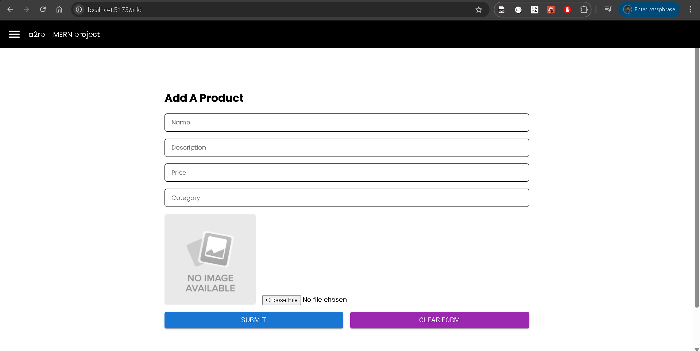

# 🛍️ MERN E-Commerce Frontend

This is the frontend for a MERN eCommerce product manager built with **React + Vite**.
You can add new products and see all added products visually.

---

## 🚀 Features

-   Add product (with image upload)
-   Preview uploaded image
-   Reset form
-   Loading spinner (MUI)
-   View all products
-   Image support from backend
-   Toast notifications (react-toastify)

---

## ⚙️ Tech Stack

-   React + Vite
-   Axios
-   Styled-components
-   React Router
-   React Toastify
-   MUI (for loader)

---

## 📸 Screenshots

✅ Product List with Images  


✅ Product Add Form  


---

## 🔧 Setup

```bash
cd frontend
npm install
```

Create a .env file:

```
VITE_BACKEND_URL=http://localhost:1198
```

run the app

```
npm run dev
```

🔗 Backend API Reference
Make sure backend is running on http://localhost:1198
All images must be accessed via:

```
http://localhost:1198/uploads/<filename>
```
